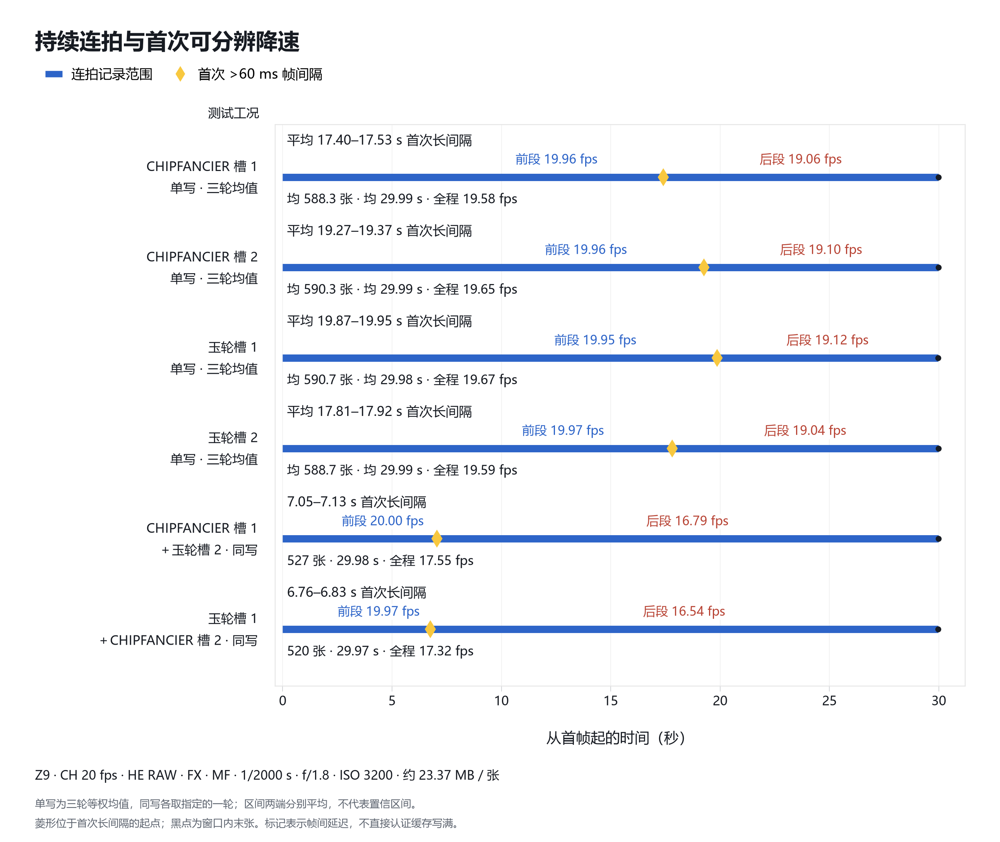

# Z9 内存卡连拍实测：两卡近似同速，双卡同写更早降速

*测试日期：2026 年 9 月 17 日｜整理日期：2026 年 9 月 18 日｜HE RAW、20 fps，统一比较前 30 秒*

这次测试想回答三个实际问题：两张存储卡放进 Z9 后，连拍表现是否不同；同一张卡换一个槽位，表现是否改变；开启双卡备份，需要付出多少连拍速度的代价。

在本次拍摄条件下，四个单写工况前 30 秒平均拍到约 588–591 张，首次延迟后的平均帧率为 19.04–19.12 fps。两组双卡同写分别拍到 527 张、520 张，后段降至 16.79 fps、16.54 fps。**两张卡和两个槽位的单写差距很小，双卡同写带来的变化更明显。**

*图 1：蓝条表示窗口内首张至末张的实际记录跨度，黑点表示末张位置；菱形位于首次长间隔的起点。单写为三轮等权均值，同写各采用指定的一轮。条下的 fps 是全程平均帧率，后文另列首次延迟之后的平均值。单写时间区间的两端分别求平均，不代表轮间极差或置信区间。*

测试使用 Nikon Z9，固件记录为 5.32。两张卡分别是 **CHIPFANCIER CFexpress TYPE B Platinum PSLC640G** 和 **达墨玉轮 325G**。电脑运行 Windows 11，相机通过一根 USB 数据线接入主机后置主板接口，没有另外连接 10 针快门线。正式纳入比较的照片采用以下设置：

| 项目 | 本次设置 |
|---|---|
| 图像格式 | 仅 NEF，HE RAW（不带 *） |
| 画幅与分辨率 | FX，8256 × 5504，全分辨率 |
| 连拍 | CH，目标 20 fps |
| 曝光 | M，1/2000 秒，f/1.8，固定 ISO 3200 |
| 对焦 | 每轮先自动合焦一次，实际连拍期间 MF |
| 其他控制 | 自动 ISO 关闭，固定白平衡，关闭闪烁抑制、降噪及包围等 |
| 存储 | 照片写入卡内，拍摄期间不向电脑下载图像 |
| 单张文件大小 | 平均约 23.37 MB |
| 原定采集计划 | 每工况三轮，每轮 60 秒；元数据取回和设置恢复后冷却至少 120 秒 |

电脑经 USB 配置、启动机内自动捕获，让相机自行执行一次持续连拍，再读取结果。自动捕获支持指定每次拍摄的时长；尼康说明，在设置了时长的情况下，即使触发条件不再满足，也会按所选时间继续拍摄，同时提示部分设置可能使拍摄提前结束。[尼康自动捕获说明](https://onlinemanual.nikonimglib.com/z9/en/psm_auto_capture_123.html)

每轮的设置、触发、计时、证据收集、分析和恢复由脚本完成。换槽和取卡仍然需要人操作，因此流程按装卡状态安排，先完成当前状态下能够进行的测试，再进入下一种状态。

| 装卡状态 | 在该状态下进行的测试  |
|---|---|
| CHIP 槽 1，玉轮槽 2 | CHIP 槽 1 单写；双卡同写  |
| 槽 1 空，玉轮槽 2 | 玉轮槽 2 单写  |
| 玉轮槽 1，CHIP 槽 2 | 玉轮槽 1 单写；双卡同写  |
| 槽 1 空，CHIP槽 2 | CHIP 槽 2 单写  |

| 工况 | 本文采用的数据 | 30 秒窗口结论 |
|---|---|---|
| CHIP 槽 1 单写 | 三轮完整记录的前 30 秒 | 三轮可用 |
| CHIP 槽 2 单写 | 三轮完整记录的前 30 秒 | 三轮可用 |
| 玉轮槽 1 单写 | 三轮完整记录的前 30 秒 | 三轮可用 |
| 玉轮槽 2 单写 | 三轮完整记录的前 30 秒 | 三轮可用 |
| CHIPFANCIER 槽 1＋玉轮槽 2 同写 | 跨度 36.73 秒 | 一轮可用 |
| 玉轮槽 1＋CHIPFANCIER 槽 2 同写 | 跨度 38.80 秒 | 一轮可用 |

主统计把**第一个严格超过 60 ms 的帧间隔**定义为首次可分辨延迟。20 fps 的标称间隔是 50 ms，额外给出 10 ms 的时间量化容差，因此 40、50、60 ms 的间隔都不会触发标记。若首次异常发生在第 k 张与第 k+1 张之间，前段计算第 1 至第 k 张之间的全部间隔；后段从第 k 张一直算到窗口内最后一张，包含整个首次延迟和之后恢复正常节奏的照片。两段均用“间隔数 ÷ 实际跨度”，每个间隔只计一次。

| 工况 | 未掉速帧率 | 首次掉速时间 | 掉速后平均帧率 | 前 30 秒曝光数 |
|---|---:|---:|---:|---:|
| CHIPFANCIER 槽 1 单写，n=3 | 19.96 fps | 17.40–17.53 s | 19.06 fps | 588.3 |
| CHIPFANCIER 槽 2 单写，n=3 | 19.96 fps | 19.27–19.37 s | 19.10 fps | 590.3 |
| 玉轮槽 1 单写，n=3 | 19.95 fps | 19.87–19.95 s | 19.12 fps | 590.7 |
| 玉轮槽 2 单写，n=3 | 19.97 fps | 17.81–17.92 s | 19.04 fps | 588.7 |
| CHIPFANCIER 槽 1＋玉轮槽 2 同写，n=1 | 20.00 fps | 7.05–7.13 s | 16.79 fps | 527 |
| 玉轮槽 1＋CHIPFANCIER 槽 2 同写，n=1 | 19.97 fps | 6.76–6.83 s | 16.54 fps | 520 |

最明显的变化来自双卡同写。以四个单写工况平均约 19.08 fps 的后段表现为参照，两次同写分别低约 12.0% 和 13.3%。以单写前 30 秒平均 589.5 张为参照，同写分别少拍 62.5 张和 69.5 张，约减少 10.6% 和 11.8%。

换卡、换槽带来的差别小得多。把单写按卡和槽分别汇总，可以得到以下描述性均值；每项包含两个工况、各三轮。

| 汇总对象 | 掉速后平均帧率 | 前 30 秒平均曝光数 |
|---|---:|---:|
| CHIPFANCIER | 19.080 fps | 589.33 张 |
| 玉轮 | 19.084 fps | 589.67 张 |
| 槽 1 | 19.093 fps | 589.50 张 |
| 槽 2 | 19.071 fps | 589.50 张 |

就这两个应用指标而言，两张卡和两个槽位可以视为近似同速。当前数据没有识别出稳定、具有实际意义的槽位速度优势。尼康将 Z9 的双槽描述为匹配的、彼此独立的 CFexpress Type B 插槽，并兼容 XQD。这支持“两槽具有相同接口类型”的说法。至于内部写入是否平均分配资源、谁先完成落盘，本次没有测量，不能从连拍结果接近推出优先级完全相同。[尼康 Z9 双槽介绍](https://www.nikonusa.com/p/z-9/1669/overview)

